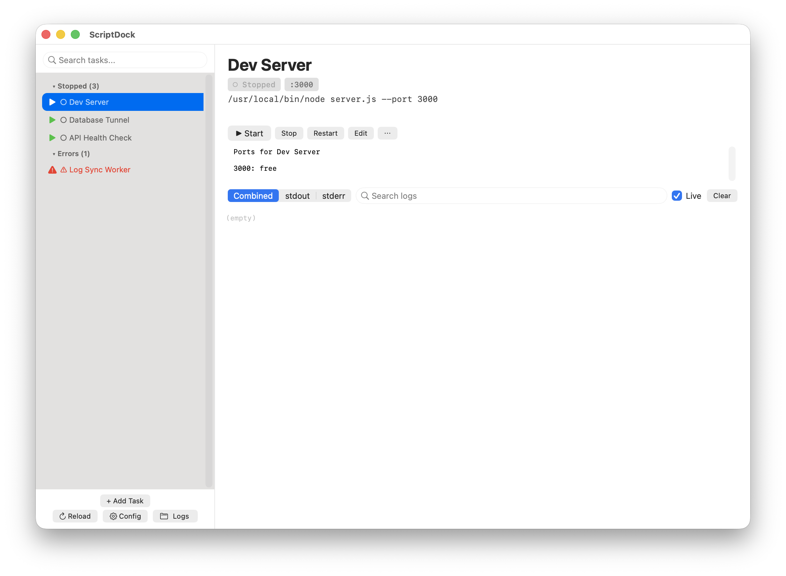
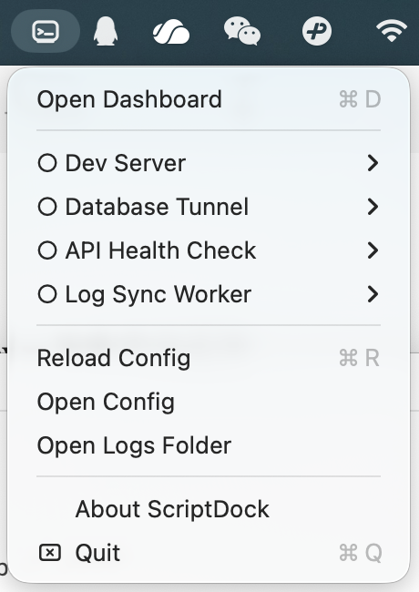
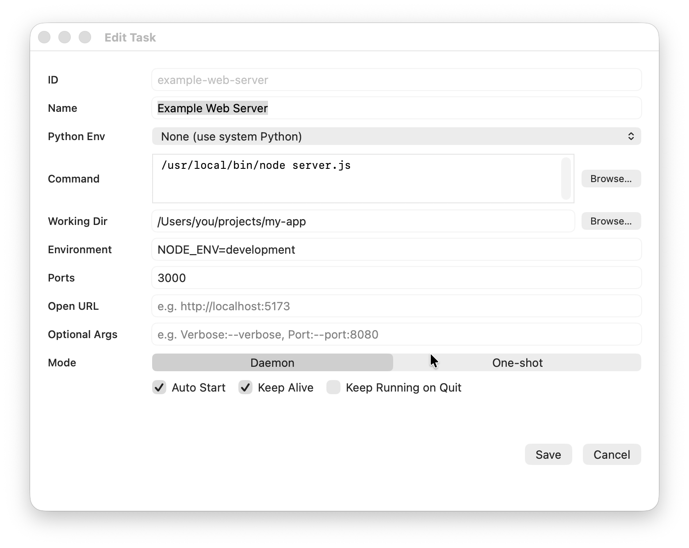

# ScriptDock

[English](README.md)

ScriptDock 是一个 macOS 菜单栏应用，让你在一个统一的地方注册、监控和控制所有本地常驻脚本——开发服务器、SSH 隧道、同步任务、机器人，任何需要后台持续运行的进程。







## 为什么需要 ScriptDock

如果你有一些本地脚本需要持续运行，你大概试过以下方案的排列组合：

- 在终端里 `nohup`、`disown`、`&`，然后不小心关掉了窗口
- 开了一堆 `tmux` / `screen` 会话，过几天再也找不回来
- 手写 `launchd` `.plist` 文件，反复 `launchctl load` / `unload`
- 留几个终端标签页，每个跑一个服务，时不时切过去看一眼

问题始终一样：看不到什么在跑、出了问题找不到日志、端口被占了不知道是谁、服务挂了要重新翻出命令来启动。

ScriptDock 解决这个问题——给每个脚本一个"家"，在一个持久的、可搜索的面板里启动、停止、重启、查看日志，不用离开应用。

## 主要功能

- **进程管理器** — ScriptDock 通过 `Foundation.Process` 直接管理子进程。Daemon 任务在 ScriptDock 运行期间崩溃后自动重启；One-shot 任务运行一次并报告退出码。Run-at-load 任务会在 ScriptDock 启动时恢复。
- **实时仪表盘** — 侧边栏按状态分组（运行中 / 已停止），选中任意任务查看实时日志、端口占用、PID。
- **内联控制** — 侧边栏直接提供播放、停止、重启按钮，无需切换上下文。
- **日志查看器** — 环形缓冲的 stdout / stderr 实时流，支持搜索和流切换。时间戳在 Pipe 层直接注入，无需 wrapper 脚本，无缓冲问题。
- **端口监控** — 自动从 `openURL`、`--port` 参数、SSH `-L` 转发、`PORT` 环境变量中推断端口。一键杀掉占用端口的进程。
- **任务模式** — 在 *Daemon*（ScriptDock 运行期间崩溃自动重启）和 *One-shot*（运行一次，显示退出码）之间选择。
- **MCP 服务器** — 内置 Model Context Protocol 服务器，让 AI 编程助手（Claude Code、Cursor）直接列出进程、读取日志、启停任务、注册新进程，不用离开编辑器。
- **默认安全** — 命令使用显式 argv 数组（无 shell 注入风险），任务 ID 限制为安全字符，一切以当前用户权限运行，不需要 `sudo`。

## 快速开始

### 环境要求

- macOS 14.0+

### 从源码构建

```bash
git clone https://github.com/pangy9/ScriptDock.git
cd ScriptDock
make
open ScriptDock.app
```

首次启动会自动创建配置和日志目录：

```text
~/Library/Application Support/ScriptDock/scripts.json
~/Library/Application Support/ScriptDock/logs/
```

### 下载安装

从 [最新发布](https://github.com/pangy9/ScriptDock/releases/latest) 下载 `ScriptDock.zip`，解压后拖入 `/Applications`。

由于应用未使用 Apple 开发者证书签名，macOS 会阻止首次打开。执行以下命令绕过：

```bash
xattr -cr /Applications/ScriptDock.app
```

之后即可正常打开。

## 配置

编辑 `scripts.json`（或使用内置任务编辑器）添加任务：

```json
{
  "tasks": [
    {
      "id": "dev-server",
      "name": "开发服务器",
      "programArguments": ["/usr/local/bin/node", "server.js", "--port", "3000"],
      "workingDirectory": "/Users/you/projects/my-app",
      "mode": "daemon",
      "runAtLoad": true,
      "keepAlive": true,
      "keepRunningOnQuit": false,
      "ports": [3000],
      "environment": { "NODE_ENV": "development" }
    },
    {
      "id": "api-health",
      "name": "API 健康检查",
      "programArguments": ["curl", "-s", "https://api.example.com/health"],
      "mode": "oneshot"
    }
  ]
}
```

每个任务使用 argv 数组。`mode` 可选 `daemon`（ScriptDock 运行期间崩溃自动重启）或 `oneshot`（运行一次）。未设置 `mode` 时从 `keepAlive`/`runAtLoad` 推断，向后兼容。退出 ScriptDock 时会向运行中的任务发送停止信号，除非将 `keepRunningOnQuit` 设为 `true`。随时从菜单栏或仪表盘重新加载配置。

## MCP 集成

ScriptDock 内置 MCP 服务器，让 AI 编程助手直接管理你的进程。

### Claude Code

```bash
claude mcp add scriptdock -- /Applications/ScriptDock.app/Contents/MacOS/scriptdock-mcp
```

### Cursor / 其他 MCP 客户端

```json
{
  "mcpServers": {
    "scriptdock": {
      "command": "/Applications/ScriptDock.app/Contents/MacOS/scriptdock-mcp"
    }
  }
}
```

### 可用工具

| 工具 | 说明 |
| --- | --- |
| `list_processes` | 列出所有进程及状态 |
| `start_process` | 启动进程 |
| `stop_process` | 停止运行中的进程 |
| `restart_process` | 重启进程 |
| `get_process_status` | 查看进程详细状态 |
| `get_process_logs` | 读取 stdout/stderr 日志 |
| `check_ports` | 检查指定端口的占用情况 |
| `kill_port_blockers` | 杀掉占用指定端口的进程 |
| `register_process` | 通过 MCP 注册新进程 |

## 隐私

ScriptDock 完全运行在你的 Mac 上。不会向任何外部服务发送任务定义、日志、环境变量或其他数据。Supervisor API 仅绑定到 `127.0.0.1:26216`。

## 支持

如果 ScriptDock 对你有帮助，欢迎给个 Star 或打赏支持持续开发：

<a href="https://paypal.me/pangy9">
  
</a>


## 许可证

MIT
